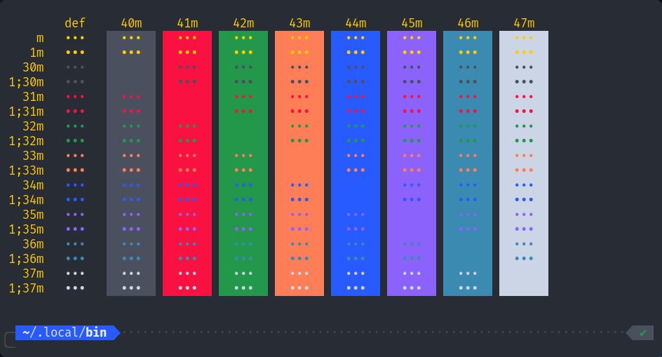

# Bluloco kitty terminal theme

This theme is inspired by [Bluloco Dark Theme](https://github.com/uloco/theme-bluloco-dark) vs code theme. Special thanks to the [Umut Topuzoğlu](https://github.com/uloco/), developer of this theme, and my endeavors for ricing my terminal that stands perfectly with my VS Code.

## Requirements

This repository requires the following modules:

1. [kitty](https://sw.kovidgoyal.net/kitty/), highly customizable and fast terminal-based emulators.
2. macOS or Linux-based Operating System(i use, Arch btw!)

## How to use?

1. To install kitty on Arch-based Operating system, use `sudo pacman -S kitty`.
2. Clone this repo using
   `git clone https://github.com/raunaktr/Bluloco-kitty-terminal-theme.git`
   command in your home repository. (_You can remove it later_)

3. `cd Bluloco-kitty-terminal-theme/` in your kitty terminal.
4. Now, copy `Bluloco-dark.conf` in kitty configuration files using.
   ` cp Bluloco-dark.conf ~/.config/kitty/kitty-themes/themes/`
5. Now, make a symbolic link of Bluloco-dark.conf to kitty's theme.conf. Use,

> `ln -s ~/.config/kitty/kitty-themes/themes/Bluloco-dark.conf ~/.config/kitty/theme.conf`.

Star this repo, if you like it. Also, as the developer of this theme said, give it a try :)

Checkout my [dotfiles :wrench:](https://github.com/raunaktr/dotfiles).
